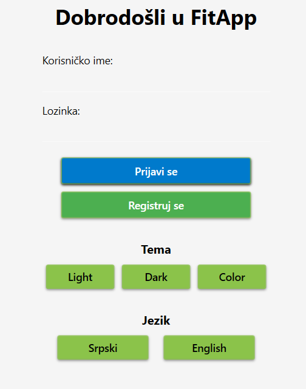
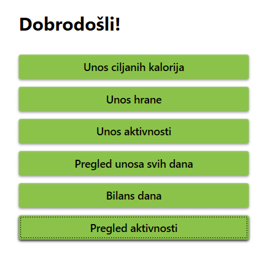
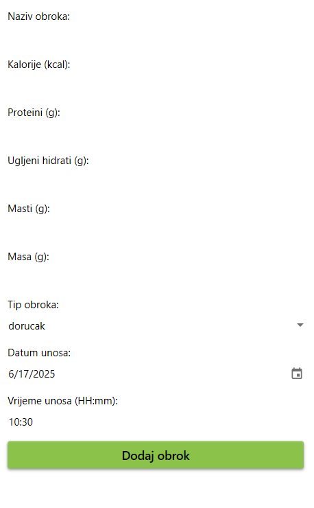
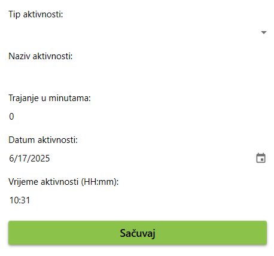
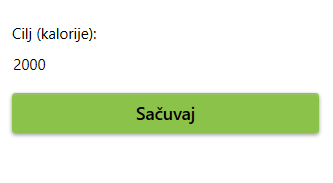
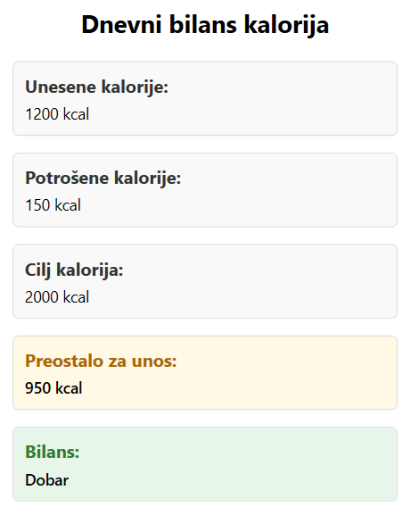
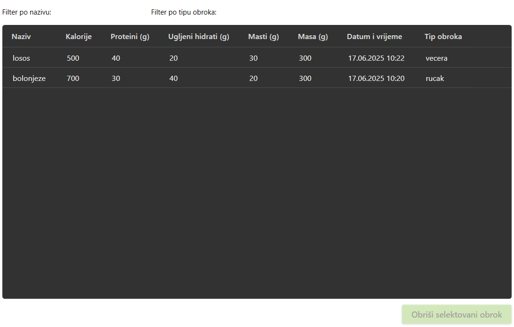
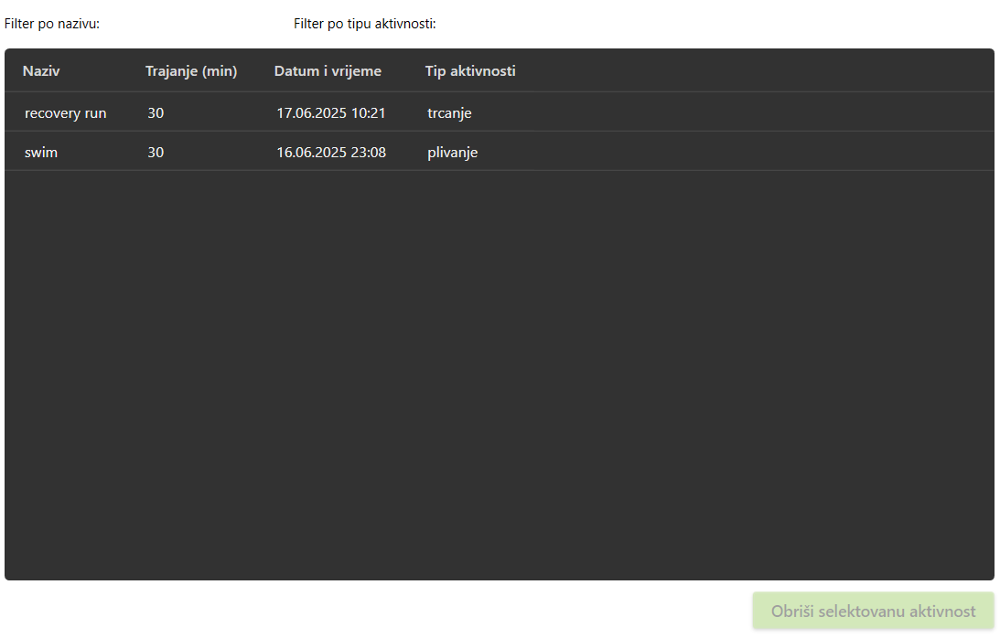
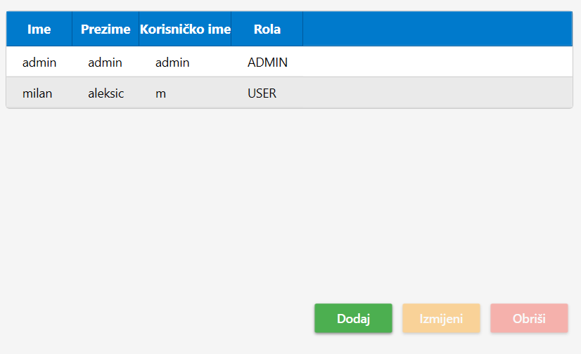
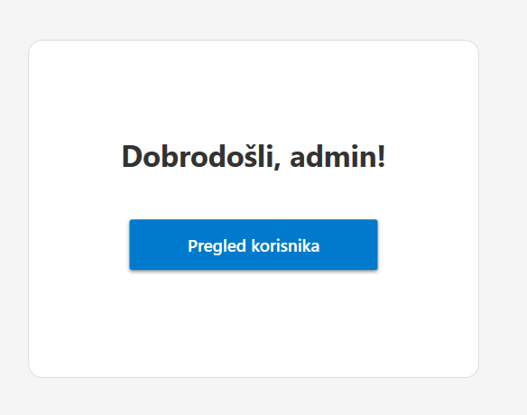

# Fit – Calorie Tracking Application

A desktop calorie tracking application built with **C#, .NET 8, WPF, Entity Framework Core, and MySQL**.

Fit helps users track meals, physical activities, daily calorie goals, and calorie balance through a modern desktop interface. The application also includes user registration, authentication, role-based functionality, localization, theme customization, and administrative user management.

The project follows the **MVVM pattern**, separating the user interface, presentation logic, and data model.

---

## 🚀 Key Features

* 🔐 User authentication and registration
* 👤 User and administrator roles
* 🍽️ Meal and calorie tracking
* 🥩 Macronutrient tracking
* 🏃 Physical activity tracking
* 🎯 Daily calorie goals
* 📊 Daily calorie balance
* 🔎 Filtering and data overview
* 👥 Administrative user management
* 🌐 Serbian and English localization
* 🎨 Multiple application themes
* 💾 MySQL database persistence
* 🔒 PBKDF2 password hashing with legacy SHA-256 compatibility

---

## 🛠️ Technology Stack

### Application

* **C#**
* **.NET 8**
* **WPF (Windows Presentation Foundation)**
* **XAML**
* **MVVM**

### Data Access

* **Entity Framework Core 8**
* **Pomelo Entity Framework Core MySQL Provider**
* **MySQL**

### UI

* **Material Design in XAML Toolkit**
* **LiveCharts**
* **WPF Resource Dictionaries**

### Development

* **Git & GitHub**
* **Visual Studio / .NET CLI**
* **NuGet**

---

## 🏗️ Application Architecture

The application is organized using the MVVM pattern:

```text
┌─────────────────────────────┐
│          WPF Views          │
│        XAML Windows         │
└──────────────┬──────────────┘
               │
               ▼
┌─────────────────────────────┐
│         ViewModels          │
│ UI Logic / Commands / State │
└──────────────┬──────────────┘
               │
               ▼
┌─────────────────────────────┐
│           Models            │
│ Entity Framework Entities   │
└──────────────┬──────────────┘
               │
               ▼
┌─────────────────────────────┐
│        FitAppContext        │
│   Entity Framework Core     │
└──────────────┬──────────────┘
               │
               ▼
┌─────────────────────────────┐
│        MySQL Database       │
└─────────────────────────────┘
```

The UI is implemented with WPF and XAML, while ViewModels contain presentation and interaction logic. Entity Framework Core is used for persistence and MySQL database access.

---

## 📸 Screenshots

### Login

<p align="center">
  
</p>

### User Dashboard

<p align="center">
  
</p>

### Meal Tracking

<p align="center">
  
</p>

### Activity Tracking

<p align="center">
  
</p>

### Daily Calorie Goal

<p align="center">
  
</p>

### Calorie Balance

<p align="center">
  
</p>

### Meal History

<p align="center">
  
</p>

### Activity History

<p align="center">
  
</p>

### User Administration

<p align="center">
  
</p>

### Administrator Dashboard

<p align="center">
  
</p>

---

## 📖 Application Overview

Fit was originally developed as an academic project focused on **human-computer interaction and desktop application design** at the Faculty of Electrical Engineering, University of Banja Luka.

The application allows users to manage meals, activities, calorie goals, and historical records while providing separate functionality for administrators.

The project was later prepared as a portfolio project with improvements to repository structure, configuration management, and application security.

---

# 📘 Korisničko uputstvo

**Naziv aplikacije:** FIT – Aplikacija za praćenje kalorija
**Autor:** Milan Aleksić
**Studijski program:** Softversko inženjerstvo
**Godina izrade:** 2025.

Aplikacija je originalno razvijena kao dio projektnog rada na predmetu **Interakcija čovjek-računar** na Elektrotehničkom fakultetu Univerziteta u Banjoj Luci.

---

## 1. 📘 Uvod

Osnovna namjena aplikacije **Fit** jeste da korisnicima omogući praćenje dnevnog unosa kalorija kroz obroke i fizičke aktivnosti, definisanje dnevnog kalorijskog cilja i pregled kalorijskog bilansa.

Aplikacija omogućava odvojene funkcionalnosti za standardne korisnike i administratore.

---

## 2. 🧭 Korišćenje aplikacije

### 2.1 🔐 Prijava i registracija

Po pokretanju aplikacije otvara se forma za **prijavu**.

Ako korisnik nema nalog, klikom na **Registruj se** otvara se forma za unos:

* korisničkog imena,
* lozinke,
* imena,
* prezimena.

Lozinke novih korisnika se ne čuvaju u izvornom obliku, već se obrađuju korištenjem PBKDF2 password hashing mehanizma.

Nakon uspješne prijave korisnik se preusmjerava na odgovarajući interfejs u zavisnosti od svoje uloge.

---

### 2.2 🍽️ Unos obroka, aktivnosti i cilja

Korisnik može evidentirati obroke, fizičke aktivnosti i dnevni kalorijski cilj.

#### ✅ Obroci

Za obrok je moguće evidentirati:

* naziv namirnice,
* masu u gramima,
* kalorije,
* ugljene hidrate,
* proteine,
* masti,
* tip obroka,
* datum i vrijeme unosa.

#### ✅ Aktivnosti

Za fizičku aktivnost moguće je evidentirati:

* tip aktivnosti,
* trajanje u minutama,
* datum i vrijeme aktivnosti.

#### 🎯 Ciljani dnevni unos kalorija

Korisnik može definisati lični dnevni kalorijski cilj.

Definisani cilj koristi se prilikom izračunavanja i prikaza dnevnog kalorijskog bilansa.

Unesene stavke moguće je:

* dodavati,
* izmjenjivati,
* brisati,
* filtrirati i pregledati.

Korisnik takođe može pregledati prethodno unesene obroke i aktivnosti sortirane prema datumu.

---

### 2.3 📊 Bilans kalorija

Aplikacija automatski izračunava:

* **ukupan unos kalorija** iz evidentiranih obroka,
* **ukupnu potrošnju kalorija** na osnovu aktivnosti,
* **definisani dnevni cilj**,
* **preostale kalorije** u odnosu na cilj i trenutni bilans.

Bilans može biti:

* **pozitivan** – korisnik je unio više kalorija nego što je potrošio,
* **negativan** – korisnik je potrošio više kalorija,
* **neutralan** – unos i potrošnja su izbalansirani.

Rezultati se korisniku prikazuju numerički i vizuelno.

---

### 2.4 🎨 Opcije prikaza

Aplikacija podržava:

* promjenu teme interfejsa,
* svijetlu temu,
* tamnu temu,
* dodatne vizuelne teme,
* srpski jezik,
* engleski jezik.

---

## 3. 👤 User Roles

### Standard User

Standardni korisnik može:

* unositi i uređivati obroke,
* pratiti makronutrijente,
* unositi fizičke aktivnosti,
* definisati dnevni kalorijski cilj,
* pregledati istoriju obroka,
* pregledati istoriju aktivnosti,
* pregledati dnevni kalorijski bilans,
* mijenjati temu aplikacije,
* mijenjati jezik interfejsa.

### Administrator

Administrator ima dodatne mogućnosti za upravljanje korisnicima.

Administrator može:

* pregledati korisničke naloge,
* dodavati nove korisnike,
* izmjenjivati korisničke podatke,
* brisati korisnike,
* pregledati podatke vezane za korisnike.

---

## 🔐 Security

The application uses environment-based database configuration instead of storing database credentials directly in the source code.

The MySQL connection is configured through:

```text
FIT_DB_CONNECTION
```

Example local value:

```text
server=localhost;port=3306;user=YOUR_USER;password=YOUR_PASSWORD;database=fitapp
```

Database credentials should **never be committed to the repository**.

New user passwords are protected using **PBKDF2 with a randomly generated salt**.

The application also includes compatibility with legacy SHA-256 password hashes so existing accounts can be migrated to the newer password storage format after successful authentication.

---

## 📁 Project Structure

```text
fit-kalorije-app/
│
├── Languages/
│   ├── StringResources.en.xaml
│   └── StringResources.sr.xaml
│
├── Models/
│   ├── Aktivnost.cs
│   ├── Cilj.cs
│   ├── CurrentUser.cs
│   ├── FitAppContext.cs
│   ├── Korisnik.cs
│   ├── Obrok.cs
│   ├── Rola.cs
│   ├── TipAktivnosti.cs
│   └── TipObroka.cs
│
├── Security/
│   └── PasswordHasher.cs
│
├── ViewModels/
│   ├── BilansViewModel.cs
│   ├── LoginViewModel.cs
│   ├── PregledKorisnikaViewModel.cs
│   ├── PrikazAktivnostiViewModel.cs
│   ├── PrikazUnosaViewModel.cs
│   ├── RegistracijaViewModel.cs
│   ├── UnosAktivnostiViewModel.cs
│   ├── UnosCiljaViewModel.cs
│   └── UnosHraneViewModel.cs
│
├── Views/
│   ├── AdminDashboardWindow.xaml
│   ├── DashboardWindow.xaml
│   ├── BilansWindow.xaml
│   ├── KorisnikFormaWindow.xaml
│   ├── PregledAktivnostiWindow.xaml
│   ├── PregledKorisnikaView.xaml
│   ├── PrikazUnosaWindow.xaml
│   ├── RegisterWindow.xaml
│   ├── StatistikaWindow.xaml
│   ├── UnosAktivnostiWindow.xaml
│   ├── UnosCiljaWindow.xaml
│   └── UnosHraneWindow.xaml
│
├── images/
├── App.xaml
├── App.xaml.cs
├── MainWindow.xaml
├── MainWindow.xaml.cs
├── RelayCommand.cs
├── Fit.csproj
├── Fit.sln
└── README.md
```

---

## 🎓 Project Background

This application was originally developed in **2025** as an academic project at the **Faculty of Electrical Engineering, University of Banja Luka**, within the Software Engineering study program.

The project demonstrates practical work with:

* desktop application development,
* C# and .NET,
* WPF and XAML,
* MVVM architecture,
* Entity Framework Core,
* relational databases,
* authentication,
* role-based functionality,
* localization,
* UI/UX design,
* Git version control.

---

## 📬 Contact

**Milan Aleksić**

GitHub: `Alexic11`

Repository: `Alexic11/fit-kalorije-app`
